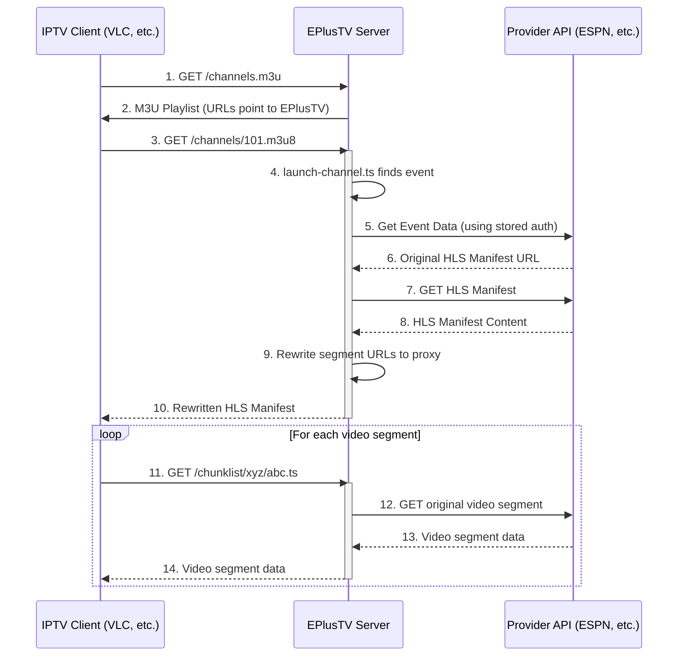
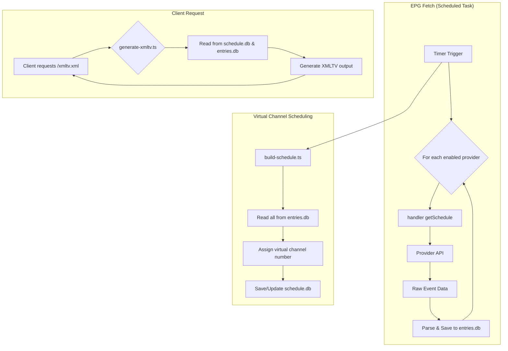
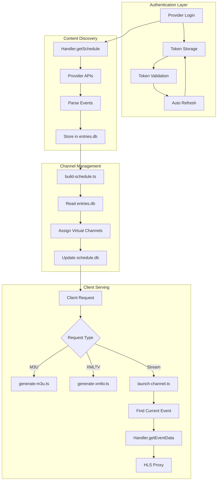

# Architecture Overview

This document provides a detailed overview of the EPlusTV application's architecture. It is intended for developers who want to understand how the system works, how to add new features, or how to debug existing ones.

## Core Concepts

EPlusTV's primary function is to aggregate sports streams from various providers and present them as standard IPTV channels, complete with M3U playlists and XMLTV electronic program guides (EPG).

### Streaming Model: The Proxy Server

A crucial concept to understand is that **this server acts as a proxy for all video streams**. The client (e.g., VLC, Kodi, Channels DVR) never connects directly to the source provider (like ESPN or MLB).

The data flow for streaming is as follows:

1.  **M3U Playlist Request**: The client requests the channel playlist (`/channels.m3u`) from the EPlusTV server.
2.  **Playlist Generation**: The server generates this M3U file. The URLs for each channel inside this file point *back to the EPlusTV server itself* (e.g., `http://<server_ip>/channels/101.m3u8`).
3.  **Channel Selection**: The user selects a channel in their client. The client then requests the corresponding `.m3u8` URL from the EPlusTV server.
4.  **Stream Launch**: This request hits the EPlusTV server, which identifies the currently scheduled event for that virtual channel.
5.  **Provider Connection**: The server uses the appropriate provider "handler" to fetch the *actual* HLS stream manifest URL from the source (e.g., ESPN's servers). This involves using the stored authentication tokens for that provider.
6.  **Manifest Rewriting (Proxying)**: The server fetches the provider's HLS manifest. It then **rewrites** all the URLs for the video segments (`.ts` files) inside the manifest to also point back to the EPlusTV server.
7.  **Client Playback**: The rewritten manifest is sent to the client. The client then requests each video segment from the EPlusTV server, which in turn fetches it from the provider and streams it to the client.

This proxy model is why authentication is handled on the server-side; it needs to act as an authenticated client on behalf of the user.



## Data and Scheduling Flow

The application periodically fetches event data from all enabled providers, stores it, and then builds a virtual schedule.



## Project Structure

The project is a Node.js application written in TypeScript, using Hono for the web server and JSX for templating the admin UI.

-   `index.tsx`: The main entry point. It sets up the Hono server, defines the primary routes (`/channels.m3u`, `/xmltv.xml`, `/channels/:id.m3u8`), and mounts the provider-specific UI routes.
-   `views/`: Contains the main layout components for the web UI (header, styles, etc.).
-   `services/`: This is the heart of the backend logic.
    -   It contains individual `[provider]-handler.ts` files for each streaming provider.
    -   It also contains core services for scheduling, playlist generation, and the streaming proxy itself.
-   `services/providers/`: This directory contains the **frontend UI and backend route handling** for the admin panel's provider configuration cards.
    -   Each subdirectory corresponds to a provider.
    -   `[provider]/index.tsx`: Defines the Hono routes for handling UI interactions (e.g., toggling the provider, submitting login forms).
    -   `[provider]/views/`: Contains the JSX components that render the provider's configuration card in the browser.

## Key Files and Their Roles

### Backend Logic (`services/`)

-   **`services/[provider]-handler.ts`** (e.g., `espn-handler.ts`, `mlb-handler.ts`)
    -   **Role**: Contains all logic for a single provider. This is the primary file to edit when fixing a provider or adding a new one.
    -   **Key Methods**:
        -   `initialize()`: Sets up the provider, loading tokens from the database.
        -   `refreshTokens()`: Logic to refresh expired authentication tokens.
        -   `getSchedule()`: Fetches the schedule of events from the provider's API and stores them in the `entries.db` database.
        -   `getEventData(eventId)`: The most critical method for streaming. Given an event ID, it performs the necessary API calls to get the master HLS manifest URL from the provider.

-   **`services/launch-channel.ts`**
    -   **Role**: Manages the HLS proxying. It's triggered when a client requests a `.m3u8` file.
    -   **Functionality**: It finds the correct provider handler for the current event, calls its `getEventData()` method, and then uses `PlaylistHandler` to fetch and rewrite the manifest.

-   **`services/playlist-handler.ts`**
    -   **Role**: The low-level HLS manifest parser and rewriter. It replaces segment and key URLs with URLs that point back to the EPlusTV server, enabling the proxy.

-   **`services/generate-m3u.ts` & `services/generate-xmltv.ts`**
    -   **Role**: These files are responsible for generating the M3U playlist and XMLTV guide data based on the scheduled events in the database.

-   **`services/build-schedule.ts`**
    -   **Role**: Contains the logic for the virtual channel scheduler. It takes all the events fetched by the handlers (from `entries.db`) and assigns them to an available virtual channel slot in the `schedule.db`.

-   **`services/database.ts`**
    -   **Role**: Initializes the NeDB databases used for storing provider configurations, schedule data, and event entries.

### Frontend & UI Logic (`services/providers/`)

-   **`services/providers/index.ts`**
    -   **Role**: This file aggregates all the individual provider route handlers and exports them as a single Hono app to be mounted by the main `index.tsx`.

-   **`services/providers/[provider]/index.tsx`** (e.g., `services/providers/espn/index.tsx`)
    -   **Role**: Defines the API routes for a specific provider's UI card. It handles `PUT` and `POST` requests from the frontend, typically triggered by HTMX.
    -   **Functionality**: Handles toggling the provider on/off, processing login forms, and updating settings. It calls the corresponding handler's methods (e.g., `espnHandler.authenticateLinearRegCode()`) and returns updated JSX components to the browser.

-   **`services/providers/[provider]/views/`** (e.g., `services/providers/espn/views/`)
    -   **Role**: Contains the actual JSX components that make up the UI for a provider's card.
    -   **Key Components**:
        -   `index.tsx`: The main card component.
        -   `Login.tsx`: The login form or activation code display.
        -   `CardBody.tsx`: The content of the card shown after being enabled/authenticated.

## Authentication Architecture Deep Dive

### Multi-Token Authentication Systems

Modern streaming providers often use complex authentication requiring multiple token types and flows. ESPN serves as the prime example of this complexity:

#### ESPN Authentication Model
ESPN uses a **dual authentication system**:

1. **BAM Tokens** (Disney+ Integration):
   - `access_token`, `refresh_token`, `id_token` for Disney+ ecosystem
   - Used for ESPN+ on-demand content
   - **ESPN Ultimate**: Premium subscribers can use BAM tokens for linear channels
   - Stored in both database (`providers` collection) and `config/espn_plus_tokens.json`

2. **Adobe Pass Tokens** (Traditional TV Provider):
   - `adobe_device_id`, `adobe_auth` for TV provider verification  
   - Used for linear ESPN channels (ESPN1, ESPN2, ESPNU, etc.)
   - Stored in both database and `config/espn_linear_tokens.json`

#### Authentication Flow Implementation
```typescript
// Example from services/espn-handler.ts
async getEventData(eventId: string) {
  const ultimateEnabled = await isEnabled('ultimate');
  const isLinearChannel = scenarios?.data?.airing?.network?.id && 
    LINEAR_NETWORKS.some(n => n === scenarios?.data?.airing?.network?.id);

  if (isEspnPlus || (ultimateEnabled && isLinearChannel)) {
    // Use BAM authentication for ESPN+ or Ultimate linear channels
    await this.getBamAccessToken();
    // ... BAM authentication flow
  } else if (isLinearChannel) {
    // Use Adobe Pass for traditional linear channels
    await this.refreshAdobeTokens();
    // ... Adobe Pass authentication flow  
  }
}
```

#### Token Persistence Strategy
All handlers implement **dual persistence**:
- **Database**: NeDB providers collection for runtime access
- **JSON Files**: Config directory for backup/recovery
- **Why Both**: Database for quick access, JSON for persistence across restarts

### Provider Handler Patterns

#### Standard Handler Lifecycle
```typescript
class ProviderHandler {
  // 1. Initialization - Load existing tokens and configuration
  async initialize(): Promise<void> {
    await this.load();        // Load from database
    this.loadJSON();         // Load from JSON files
  }

  // 2. Token Management - Automatic refresh with validation
  async refreshTokens(): Promise<void> {
    // JWT validation and expiration checking
    // Graceful failure handling
    // Rate limiting and exponential backoff
  }

  // 3. Schedule Fetching - Provider-specific EPG data
  async getSchedule(): Promise<IEntry[]> {
    // Fetch from provider APIs
    // Parse and normalize data
    // Store in entries.db
  }

  // 4. Stream Access - Critical for HLS proxy
  async getEventData(eventId: string): Promise<TChannelPlaybackInfo> {
    // Choose authentication method
    // Fetch HLS manifest URL
    // Return playback information
  }

  // 5. Persistence - Dual storage strategy
  private async save(): Promise<void> {
    // Save to database
    // Save to JSON files
  }
}
```

#### Authentication Implementation Patterns

**Token Validation**:
```typescript
const isTokenValid = (token?: string): boolean => {
  if (!token) return false;
  try {
    const decoded: IJWToken = jwt_decode(token);
    return new Date().valueOf() / 1000 < decoded.exp;
  } catch (e) {
    return false;
  }
};
```

**Graceful Authentication**:
```typescript
async getEventData(eventId: string) {
  try {
    // Primary authentication method
    return await this.authenticateWithPrimary(eventId);
  } catch (primaryError) {
    console.log('Primary auth failed, trying fallback...');
    try {
      // Fallback authentication method
      return await this.authenticateWithFallback(eventId);
    } catch (fallbackError) {
      // Graceful degradation - return error or basic stream
      throw new Error('All authentication methods failed');
    }
  }
}
```

## Database Schema and Data Flow

### NeDB Collections Structure

#### `providers` Collection
```typescript
interface IProvider<TTokens, TMeta> {
  name: string;           // Unique provider identifier
  enabled: boolean;       // Runtime toggle state
  tokens?: TTokens;       // Provider-specific authentication data
  meta?: TMeta;          // Provider-specific configuration
}

// Real ESPN+ example:
{
  name: 'espnplus',
  enabled: true,
  tokens: {
    tokens: {
      access_token: 'eyJ0eXAiOiJKV1QiLCJhbGci...',
      refresh_token: 'eyJ0eXAiOiJKV1QiLCJhbGci...',
      id_token: 'eyJ0eXAiOiJKV1QiLCJhbGci...',
      expires_in: 3600,
      ttl: 1734567890123,
      refresh_ttl: 1734571490123,
      swid: '{12345678-1234-1234-1234-123456789012}'
    },
    device_grant: {
      grant_type: 'urn:ietf:params:oauth:grant-type:token-exchange',
      assertion: 'eyJ0eXAiOiJKV1QiLCJhbGci...'
    },
    // ... other BAM authentication tokens
  },
  meta: {
    use_ppv: false,
    hide_studio: false,
    zip_code: '10001',
    in_market_teams: 'NYY,NYM',
    ultimate_subscription: false  // ESPN Ultimate premium feature
  }
}
```

#### `entries` Collection - Raw Event Data
```typescript
interface IEntry {
  id: string;              // Unique event identifier
  name: string;            // Event title
  network: string;         // Source network/provider
  start: string;           // ISO timestamp
  end: string;             // ISO timestamp
  // ... additional metadata
}
```

#### `schedule` Collection - Virtual Channel Assignments  
```typescript
interface ISchedule {
  channel: number;         // Virtual channel number (101, 102, etc.)
  name: string;           // Channel name
  events: IEntry[];       // Scheduled events for this channel
}
```

### Data Flow Architecture



## Advanced Debugging and Development

### Debug Infrastructure

The `debug/` directory provides comprehensive testing tools:

#### ESPN Handler Debug Scripts (`debug/espn-handler/`)

**📖 For complete debugging guide and token setup instructions, see [debug/README.md](./debug/README.md)**

- **Organized by Provider**: ESPN scripts separated for clarity
- **Real Authentication Testing**: Scripts for testing with actual credentials
- **Comprehensive Coverage**: All authentication flows and edge cases

```bash
# Test ESPN Ultimate authentication
npx ts-node -r tsconfig-paths/register debug/espn-handler/test-ultimate-linear.ts

# Test with real tokens (requires token setup - see debug/README.md)
npx ts-node -r tsconfig-paths/register debug/espn-handler/test-with-real-tokens.ts
```

#### Interactive Debugging
```bash
# Python pdb-like debugging experience
npx ts-node -r tsconfig-paths/register debug/interactive-debug.ts

# VS Code debugging (recommended)
# Set breakpoints and press F5 - configurations in .vscode/launch.json
```

### Common Development Patterns

#### Provider Toggle Implementation
```typescript
// UI Route Handler Pattern
provider.put('/toggle-ultimate', async c => {
  const body = await c.req.parseBody();
  const ultimate_subscription = body['feature-enabled'] === 'on';
  
  // Update database with new setting
  await db.providers.updateAsync(
    {name: 'espnplus'}, 
    {$set: {'meta.ultimate_subscription': ultimate_subscription}}
  );
  
  // Return updated UI component
  const provider = await db.providers.findOneAsync({name: 'espnplus'});
  return c.html(<UpdatedCardBody provider={provider} />);
});
```

#### Authentication State Management
```typescript
// Check provider feature states
const isEnabled = async (which: string) => {
  const {enabled: espnPlusEnabled, meta: plusMeta} = 
    await db.providers.findOneAsync({name: 'espnplus'});
    
  if (which === 'plus') {
    return espnPlusEnabled;
  } else if (which === 'ultimate') {
    // Ultimate requires BOTH ESPN+ enabled AND ultimate subscription
    return (plusMeta?.ultimate_subscription ? true : false) && espnPlusEnabled;
  }
};
```

## How to Add a New Provider

To add a new provider, "NewSport", you would follow this pattern:

1.  **Create the Handler (`services/newsport-handler.ts`)**:
    -   Create a new class `NewSportHandler`.
    -   Implement the core methods: `initialize`, `refreshTokens`, `getSchedule`, and `getEventData`.
    -   Study an existing handler like `b1g-handler.ts` (simple) or `espn-handler.ts` (complex) as a template.

2.  **Create the UI Directory (`services/providers/newsport/`)**:
    -   Create a new directory for the provider's UI components.

3.  **Create the UI Route Handler (`services/providers/newsport/index.tsx`)**:
    -   Create a Hono app that defines the routes for your UI card (e.g., `/toggle`, `/login`).
    -   These routes will call methods on your `newSportHandler` instance.

4.  **Create the UI View Components (`services/providers/newsport/views/`)**:
    -   Create the JSX components for the `Login` form and the `CardBody` that shows post-login information.

5.  **Register the Provider UI**:
    -   In `services/providers/index.ts`, import and register your new Hono app (`providers.route('/', newSport)`).

6.  **Integrate into the System**:
    -   In `services/launch-channel.ts`, add a `case` for `'newsport'` in the `switch` statement to call `newSportHandler.getEventData()`.
    -   In `index.tsx` (the main one), import your `newSportHandler` and add it to the `initialize` and `schedule` calls so its schedule is fetched automatically.

7.  **Create Debug Scripts**:
    -   Create `debug/newsport-handler/` directory with testing scripts
    -   Follow the ESPN handler debug script patterns for comprehensive testing
    -   Test authentication flows, token refresh, and error handling

8.  **Authentication Implementation**:
    -   Implement dual token persistence (database + JSON files)
    -   Add graceful authentication failure handling  
    -   Use JWT validation patterns for token expiration checking
    -   Implement throttled token refresh to avoid rate limiting
